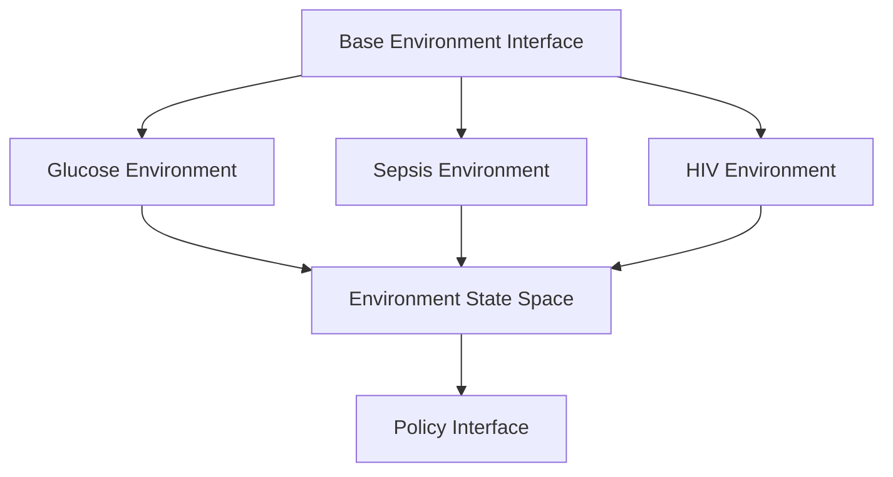
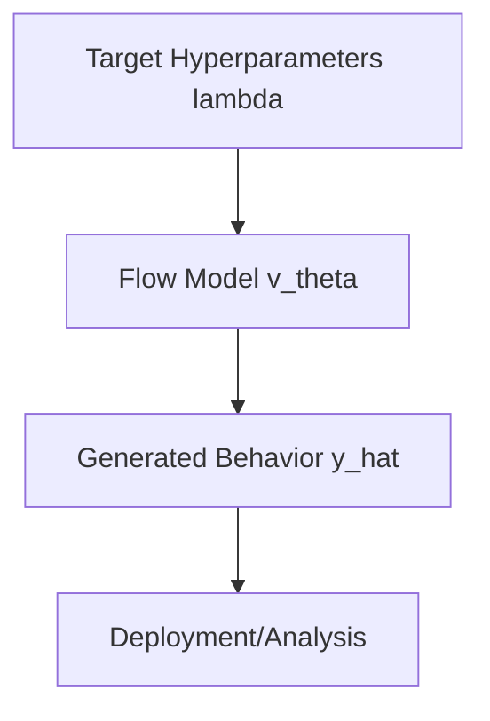

# Architecture Overview

## High-Level Goal

This project aims to learn the trajectory of a neural network's output distribution as a function of a given hyperparameter (`\lambda`). This allows dynamic, inference-time adjustment of model behavior (e.g., policy behavior in RL) by sampling from a learned surrogate model, avoiding costly retraining of the original network for every desired hyperparameter setting.

## System Architecture

### 1. Environment Layer


Each environment provides:
- State/observation space
- Action space
- Reward function
- Transition dynamics
- Episode termination conditions

### 2. Policy Layer (Original NN)
```mermaid
graph TD
    A[Policy Interface] --> B[Policy Network P_theta_lambda]
    B --> C[MLP Architecture]
    B --> D[Value Network]
    C --> E[Policy Outputs Y]
    D --> F[Value Estimates]
    E -- given input X --> G[Behavior Collection (X, Y) pairs]
    F --> G
    H[Hyperparameter lambda] --> B
```

Components:
- Neural network policy (state `x` → action/behavior `y`)
- Value function estimation
- Hyperparameter configuration
- Behavior data collection (collects `(x, y)` pairs)

### 3. Metric & Geodesic Learning Layer
```mermaid
graph TD
    A[Policy Behaviors (X,Y) pairs] --> B(Joint Metric/Geodesic Learner)
    B --> C[Riemannian Metric A(y,x)]
    B --> D[Geodesic Predictor phi(y0, y1, x)]
    E[NLOT/MFM Inspiration] --> B
    F[Hyperparameter Space lambda] --> B
    C --> G{Geodesic Properties}
    D --> G
    G --> H[Uncertainty Estimation]
```

Components:
- Neural OT-based metric learning
- MFM-based metric learning
- Geodesic computation
- Path optimization

### 4. Active Sampling Layer
```mermaid
graph TD
    A[Predicted Geodesics from phi] --> B[Uncertainty Estimator]
    B --> C[Acquisition Function]
    C --> D{Select Next lambda*}
    D -- If Budget Not Met --> E[Retrain Policy Layer at lambda*]
    E --> F[Collect New Behaviors (X, Y)* pairs]
    F --> G[Update Metric/Geodesic Layer]
    G --> A
    D -- Budget Met --> H[Final Metric/Geodesic Models]
```

Components:
- Estimates uncertainty along predicted geodesics
- Uses an acquisition function to select the most informative next hyperparameter `\lambda^*`
- Triggers retraining of the **original Policy NN** at `\lambda^*`
- Uses new behavior samples **`(x, y)*` pairs** to refine the metric `A` and predictor `\phi` iteratively

### 5. Conditional Flow Layer (Surrogate Model)
```mermaid
graph TD
    A[Predicted Geodesics from phi] --> B(Conditional Flow Matcher)
    B --> C[Velocity Field v_theta(y, lambda, x)]
    D[Base Distribution] --> C
    E[Policy Behaviors (X,Y) pairs] --> B
    F[Hyperparameter lambda] --> C
    G[Condition x] --> C
    C --> H[Sample Interpolated Behaviors y_hat]
```

Components:
- Learns a velocity field `v_\theta(y, \lambda, x)` representing the evolution of behavior `y` w.r.t `\lambda` and `x`
- Guided by the directions of the geodesics predicted by `\phi`
- Used at inference time to sample behaviors `\hat{y} ~ \hat{p}(y|x,\lambda)` for any `\lambda` by integrating `v_\theta`

## Implementation Details

### 1. Environment Wrappers
```python
class BaseEnvironment(gym.Env):
    """Base class for all environments."""
    
    def __init__(self, config: Dict[str, Any]):
        self.config = config
        self._setup_spaces()
    
    @abstractmethod
    def _setup_spaces(self):
        """Define observation and action spaces."""
        pass
    
    @abstractmethod
    def get_state_info(self) -> Dict[str, Any]:
        """Return environment-specific state information."""
        pass
```

### 2. Policy Architecture (Original NN)
```python
class PolicyNetwork(nn.Module):
    """Policy network (Original NN) trained at specific lambda."""
    
    def __init__(
        self,
        state_dim: int,
        action_dim: int,
        hidden_dims: List[int],
        hyperparams: Dict[str, float]
    ):
        super().__init__()
        self.hyperparams = hyperparams
        self.net = self._build_network(state_dim, action_dim, hidden_dims)
    
    def forward(self, state: torch.Tensor) -> Tuple[torch.Tensor, torch.Tensor]:
        """Return action distribution parameters."""
        pass
```

### 3. Metric & Geodesic Learning Architecture
```python
class MetricGeodesicLearner(nn.Module):
    """Jointly learns the metric and predicts geodesics."""
    
    def __init__(
        self,
        behavior_dim: int,
        hyperparam_dim: int,
        state_dim: int, # For conditioning x
        metric_config: Dict,
        geodesic_config: Dict,
        method: str = 'nlot_inspired' # or 'mfm_inspired'
    ):
        super().__init__()
        self.method = method
        self.metric_net = self._build_metric_network(behavior_dim, state_dim, metric_config)
        self.geodesic_predictor_net = self._build_geodesic_network(behavior_dim, state_dim, geodesic_config)

    def forward_metric(self, behaviors: torch.Tensor, states: torch.Tensor) -> torch.Tensor:
        """Compute metric tensor A(y,x) at given points."""
        # Implementation for metric computation
        pass

    def forward_geodesic(self, y_start: torch.Tensor, y_end: torch.Tensor, states: torch.Tensor) -> torch.Tensor:
        """Predict geodesic path phi(y0, y1, x)."""
        # Implementation for geodesic prediction
        pass

    def compute_loss(self, batch_data, **kwargs):
        """Compute joint loss"""
        # Combined loss for metric and geodesic predictor
        pass
```

### 4. Active Sampling Components
```python
def estimate_geodesic_uncertainty(geodesic_path: torch.Tensor) -> torch.Tensor:
    """Heuristically estimate uncertainty along the path."""
    # E.g., based on OT distance from endpoints
    pass

def acquisition_function(uncertainties: torch.Tensor) -> float:
    """Score potential lambda candidates based on uncertainty."""
    # E.g., average uncertainty across couplings/conditions
    pass

class ActiveSampler:
    def __init__(self, budget: int, initial_lambdas: List[float]):
        self.budget = budget
        self.sampled_lambdas = set(initial_lambdas)
        self.iterations = 0

    def select_next_lambda(self, metric_geodesic_model, existing_data) -> Optional[float]:
        if self.iterations >= self.budget:
            return None
        
        # 1. Predict geodesics between existing lambda samples
        # 2. Estimate uncertainty for each geodesic
        # 3. Evaluate acquisition function for candidate lambdas
        # 4. Select lambda* with highest score
        
        selected_lambda = # Choose best lambda*
        self.sampled_lambdas.add(selected_lambda)
        self.iterations += 1
        return selected_lambda
```

### 5. Conditional Flow Architecture
```python
class ConditionalFlowMatcher(nn.Module):
    """Learns the velocity field v_theta guided by geodesics."""
    
    def __init__(
        self,
        behavior_dim: int,
        hyperparam_dim: int,
        state_dim: int, # For conditioning x
        flow_config: Dict
    ):
        super().__init__()
        self.velocity_net = self._build_velocity_network(behavior_dim, hyperparam_dim, state_dim, flow_config)

    def compute_loss(self, batch_data, predicted_geodesics):
        """Compute flow matching loss (align v_theta with geodesic directions)."""
        # Loss implementation
        pass

    def sample(self, n_samples: int, x: torch.Tensor, target_lambda: float) -> torch.Tensor:
        """Sample behaviors y_hat by integrating v_theta."""
        # ODE integration from base distribution
        pass
```

## Data Flow

### 1. Overall Training Loop (Iterative Refinement)
```mermaid
graph TD
    A[Start: Initial lambda_0, lambda_1 Set] --> B(Train Original Policy NN at lambda_0)
    A --> C(Train Original Policy NN at lambda_1)
    B --> D[Collect Behaviors (X, Y)_0 pairs]
    C --> E[Collect Behaviors (X, Y)_1 pairs]
    D --> F(Train Initial Metric/Geodesic Model with (X,Y)_0, (X,Y)_1)
    E --> F
    F --> G{Active Sampling: Select lambda*}
    G -- Budget Remaining --> H[Train Original Policy NN at lambda*]
    H --> I[Collect New Behaviors (X, Y)* pairs]
    I --> J[Update Metric/Geodesic Model with (X, Y)*]
    J --> G
    G -- Budget Exhausted --> K[Final Metric/Geodesic Model]
    K --> L(Train Conditional Flow Model)
    L --> M[Final Surrogate Model v_theta]
```

**Process:**
1. Start with two initial hyperparameters (`lambda_0`, `lambda_1`).
2. Train the original policy NN separately at `lambda_0` and `lambda_1` and collect behavior samples **as `(x, y)` pairs** (`(X, Y)_0`, `(X, Y)_1`).
3. Train the initial Metric/Geodesic model using the collected **`(x, y)` pairs**.
4. **Enter the Active Sampling Loop:**
   a. Select the next most informative `lambda*` using the current Metric/Geodesic model.
   b. Train the original policy NN at `lambda*` and collect new behaviors **as `(x, y)*` pairs**.
   c. Update the Metric/Geodesic model using the new **`(x, y)*` pairs** (and potentially previous samples).
   d. Repeat until the sampling budget is exhausted.
5. Train the final Conditional Flow Matcher using the final Metric/Geodesic model and **all collected `(x, y)` pairs**.

### 2. Inference Pipeline


## Key Components

### 1. Original Policy Training
- Standard RL training (e.g., PPO) at specific `lambda` values
- Triggered by the Active Sampler

### 2. Metric & Geodesic Learning
- Joint training of `A(y,x)` and `\phi(y0, y1, x)`
- Provides geometry and path information

### 3. Active Sampling
- Iterative selection of most informative `lambda`
- Balances exploration vs. exploitation of hyperparameter space
- Drives the refinement process

### 4. Conditional Flow Matching
- Learns velocity field `v_\theta` guided by `\phi`
- Enables continuous interpolation and sampling
- Forms the final surrogate model

### 5. Evaluation System
- Policy performance metrics
- Interpolation smoothness
- Behavior space visualization
- Ablation studies

## Configuration System

### 1. Environment Configs
```yaml
environment:
  type: glucose  # or sepsis, hiv
  params:
    # Environment-specific parameters
```

### 2. Policy Configs (Original NN)
```yaml
policy:
  architecture:
    hidden_dims: [256, 256]
    activation: relu
  
  hyperparameters:
    discount: 0.99
    entropy_coef: 0.01
    # Other hyperparameters
  
  training:
    algorithm: ppo
    batch_size: 64
    n_steps: 2048
```

### 3. Metric & Geodesic Configs
```yaml
metric_geodesic:
  method: nlot_inspired # or mfm_inspired
  metric_architecture: { ... } 
  geodesic_architecture: { ... }
  
  joint_training:
    batch_size: 64
    learning_rate: 1e-4
    n_epochs_per_update: 10 # Epochs to train metric/geodesic per active sample
```

### 4. Active Sampling Configs
```yaml
active_sampling:
  budget: 20 # Max number of new lambda samples
  initial_lambdas: [0.1, 0.9]
  uncertainty_method: ot_distance_heuristic
  acquisition_strategy: max_average_uncertainty
```

### 5. Flow Configs
```yaml
flow:
  architecture:
    type: real_nvp # Or other conditional flow
    n_layers: 8
    hidden_dims: [128, 128]
  
  training:
    batch_size: 32
    learning_rate: 1e-4
    n_epochs: 100 # Epochs to train flow *after* active sampling
  
  # Interpolation settings (used during inference/evaluation)
  interpolation:
    ode_solver: dopri5
    n_steps: 100
```

## Monitoring and Logging

### 1. Training Metrics
- **Active Sampling:** Selected `lambda*`, Acquisition scores
- **Policy Training:** Rewards, value loss (for each `lambda` run)
- **Metric/Geodesic Training:** Joint loss
- **Flow Training:** Flow matching loss
- Gradient statistics for all models

### 2. Evaluation Metrics
- Interpolation smoothness
- Policy performance
- Behavior space coverage
- Hyperparameter sensitivity

### 3. Visualizations
- Training curves
- Behavior space embeddings
- Interpolation trajectories
- Performance heatmaps

## Deployment

### 1. Model Export
- Policy checkpoints
- Flow model weights
- Configuration files
- Evaluation results

### 2. Inference Pipeline
- Hyperparameter input
- Flow-based generation
- Policy reconstruction
- Deployment interface 