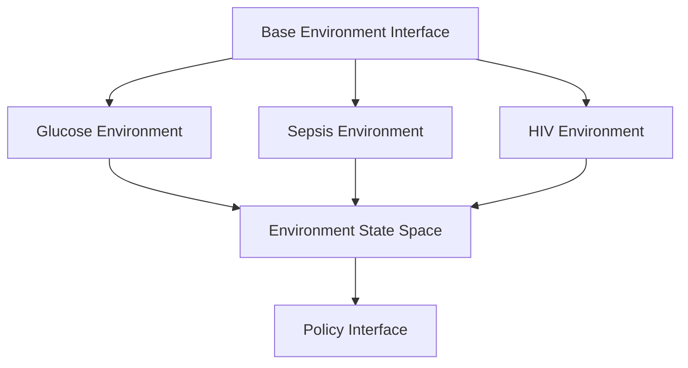
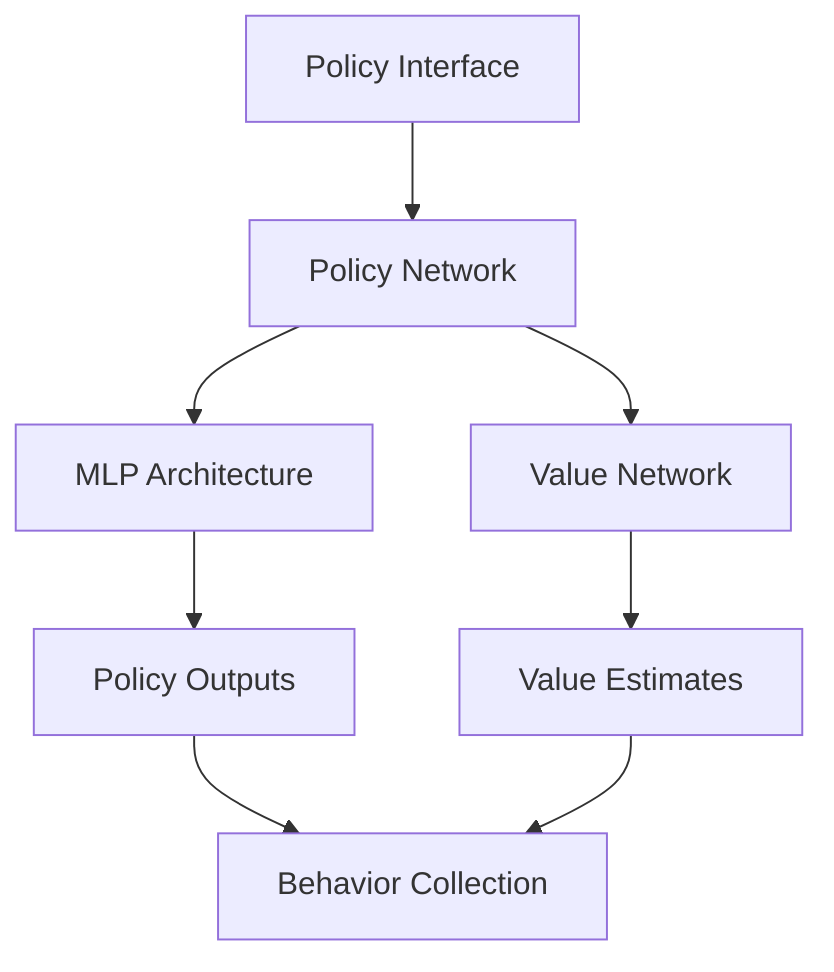
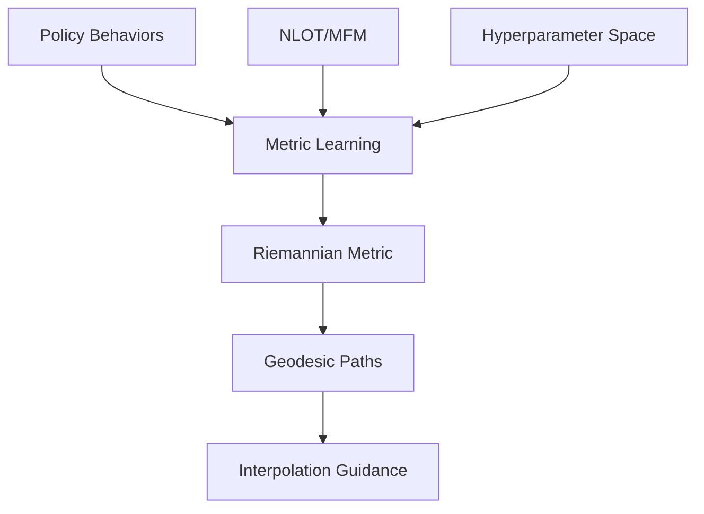
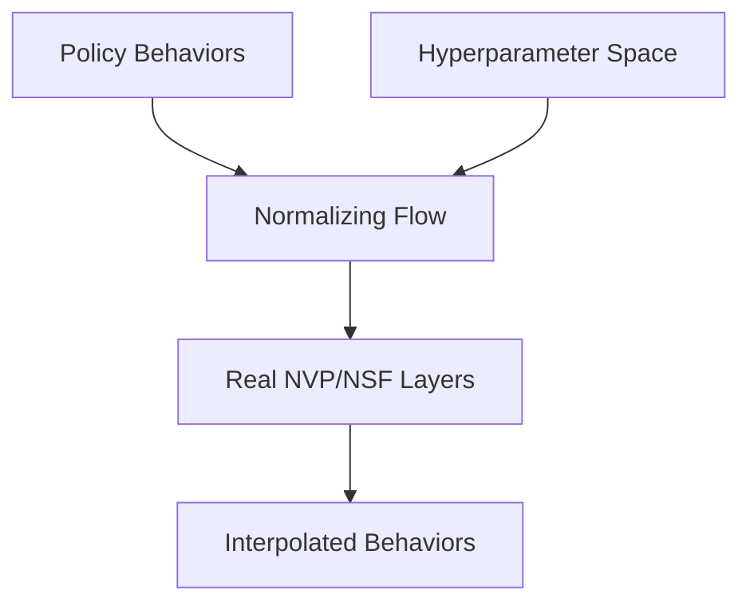
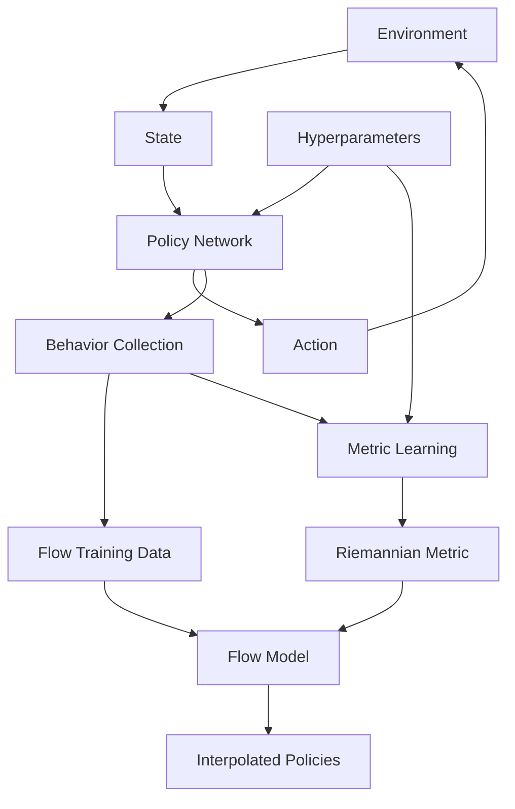
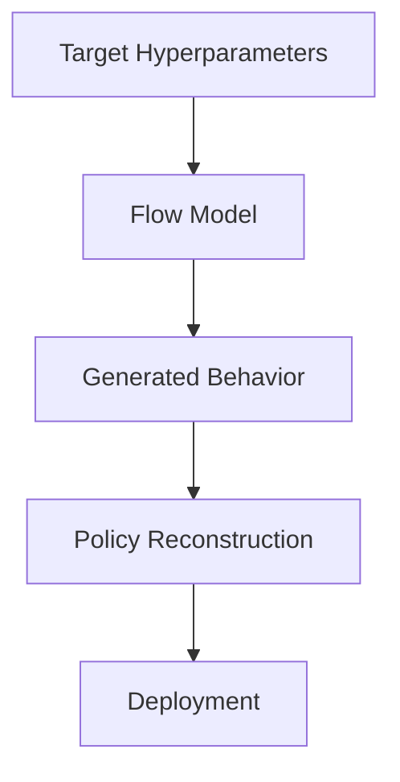

# Architecture Overview

## System Architecture

### 1. Environment Layer


Each environment provides:
- State/observation space
- Action space
- Reward function
- Transition dynamics
- Episode termination conditions

### 2. Policy Layer


Components:
- Neural network policy (state → action)
- Value function estimation
- Hyperparameter configuration
- Behavior data collection

### 3. Metric Learning Layer


Components:
- Neural OT-based metric learning
- MFM-based metric learning
- Geodesic computation
- Path optimization

### 4. Flow Layer


Components:
- Normalizing flow architecture
- Conditioning on hyperparameters
- Interpolation mechanism
- Quality metrics

## Implementation Details

### 1. Environment Wrappers
```python
class BaseEnvironment(gym.Env):
    """Base class for all environments."""
    
    def __init__(self, config: Dict[str, Any]):
        self.config = config
        self._setup_spaces()
    
    @abstractmethod
    def _setup_spaces(self):
        """Define observation and action spaces."""
        pass
    
    @abstractmethod
    def get_state_info(self) -> Dict[str, Any]:
        """Return environment-specific state information."""
        pass
```

### 2. Policy Architecture
```python
class PolicyNetwork(nn.Module):
    """Policy network with hyperparameter conditioning."""
    
    def __init__(
        self,
        state_dim: int,
        action_dim: int,
        hidden_dims: List[int],
        hyperparams: Dict[str, float]
    ):
        super().__init__()
        self.hyperparams = hyperparams
        self.net = self._build_network(state_dim, action_dim, hidden_dims)
    
    def forward(self, state: torch.Tensor) -> Tuple[torch.Tensor, torch.Tensor]:
        """Return action distribution parameters."""
        pass
```

### 3. Metric Learning Architecture
```python
class RiemannianMetric(nn.Module):
    """Learns the Riemannian metric tensor."""
    
    def __init__(
        self,
        behavior_dim: int,
        hyperparam_dim: int,
        hidden_dims: List[int],
        method: str = 'nlot'  # or 'mfm'
    ):
        super().__init__()
        self.method = method
        self.metric_net = self._build_network(
            behavior_dim + hyperparam_dim,
            hidden_dims
        )
    
    def forward(
        self,
        behaviors: torch.Tensor,
        hyperparams: torch.Tensor
    ) -> torch.Tensor:
        """Compute metric tensor at given points."""
        pass

    def compute_geodesic(
        self,
        start_point: torch.Tensor,
        end_point: torch.Tensor,
        n_steps: int = 100
    ) -> torch.Tensor:
        """Compute geodesic path between points."""
        pass

class NeuralOT(nn.Module):
    """Neural Optimal Transport for metric learning."""
    
    def __init__(
        self,
        behavior_dim: int,
        reg_strength: float = 0.1
    ):
        super().__init__()
        self.behavior_dim = behavior_dim
        self.reg_strength = reg_strength
    
    def forward(
        self,
        source: torch.Tensor,
        target: torch.Tensor
    ) -> Tuple[torch.Tensor, torch.Tensor]:
        """Compute OT map and cost."""
        pass

class MFM(nn.Module):
    """Matrix-valued Feature Metric learning."""
    
    def __init__(
        self,
        feature_dim: int,
        rank: int,
        temperature: float = 1.0
    ):
        super().__init__()
        self.feature_dim = feature_dim
        self.rank = rank
        self.temperature = temperature
    
    def forward(
        self,
        features: torch.Tensor,
        labels: torch.Tensor
    ) -> torch.Tensor:
        """Compute MFM metric."""
        pass
```

### 4. Flow Architecture
```python
class HyperparamFlow(nn.Module):
    """Normalizing flow for hyperparameter interpolation."""
    
    def __init__(
        self,
        behavior_dim: int,
        hyperparam_dim: int,
        n_layers: int,
        hidden_dims: List[int]
    ):
        super().__init__()
        self.layers = nn.ModuleList([
            RealNVPLayer(behavior_dim, hidden_dims, hyperparam_dim)
            for _ in range(n_layers)
        ])
    
    def forward(
        self,
        x: torch.Tensor,
        hyperparams: torch.Tensor
    ) -> Tuple[torch.Tensor, torch.Tensor]:
        """Transform and compute log-determinant."""
        pass
```

## Data Flow

### 1. Training Pipeline


### 2. Inference Pipeline


## Key Components

### 1. Policy Training
- PPO implementation
- Hyperparameter conditioning
- Behavior data collection
- Performance metrics

### 2. Flow Training
- Real NVP/NSF architecture
- Conditional generation
- Interpolation quality metrics
- Validation methods

### 3. Metric Learning
- Neural OT-based metric learning
- MFM-based metric learning
- Geodesic computation
- Path optimization

### 4. Evaluation System
- Policy performance metrics
- Interpolation smoothness
- Behavior space visualization
- Ablation studies

## Configuration System

### 1. Environment Configs
```yaml
environment:
  type: glucose  # or sepsis, hiv
  params:
    # Environment-specific parameters
```

### 2. Policy Configs
```yaml
policy:
  architecture:
    hidden_dims: [256, 256]
    activation: relu
  
  hyperparameters:
    discount: 0.99
    entropy_coef: 0.01
    # Other hyperparameters to interpolate
  
  training:
    algorithm: ppo
    batch_size: 64
    n_steps: 2048
```

### 3. Metric Learning Configs
```yaml
metric_learning:
  method: nlot  # or mfm
  architecture:
    hidden_dims: [128, 128]
    activation: relu
  
  nlot_params:
    reg_strength: 0.1
    n_iterations: 100
    
  mfm_params:
    rank: 10
    temperature: 1.0
    
  training:
    batch_size: 64
    learning_rate: 1e-4
    n_epochs: 50
    
  geodesic:
    n_steps: 100
    integration_method: rk4
```

### 4. Flow Configs
```yaml
flow:
  architecture:
    type: real_nvp
    n_layers: 8
    hidden_dims: [128, 128]
  
  training:
    batch_size: 32
    learning_rate: 1e-4
    n_epochs: 100
  
  interpolation:
    n_samples: 1000
    method: linear  # or geodesic
```

## Monitoring and Logging

### 1. Training Metrics
- Policy rewards
- Value losses
- Flow losses
- Gradient statistics
- Metric learning loss
- Geodesic quality measures

### 2. Evaluation Metrics
- Interpolation smoothness
- Policy performance
- Behavior space coverage
- Hyperparameter sensitivity

### 3. Visualizations
- Training curves
- Behavior space embeddings
- Interpolation trajectories
- Performance heatmaps

## Deployment

### 1. Model Export
- Policy checkpoints
- Flow model weights
- Configuration files
- Evaluation results

### 2. Inference Pipeline
- Hyperparameter input
- Flow-based generation
- Policy reconstruction
- Deployment interface 